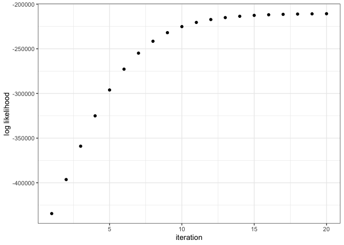
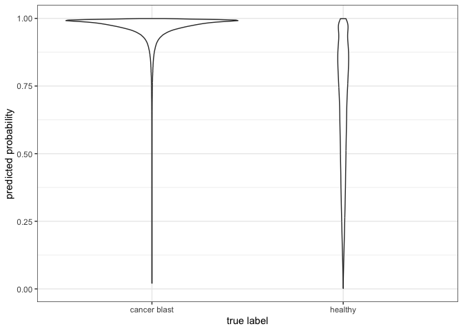
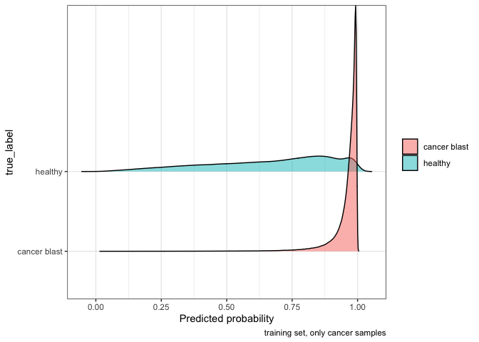
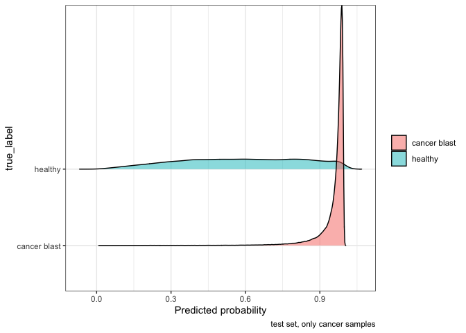
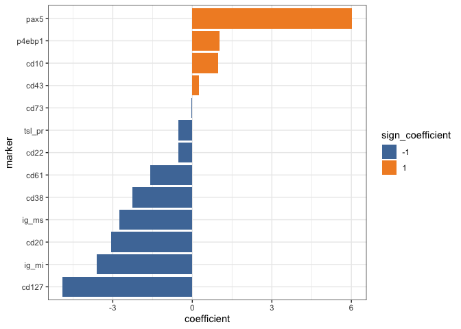
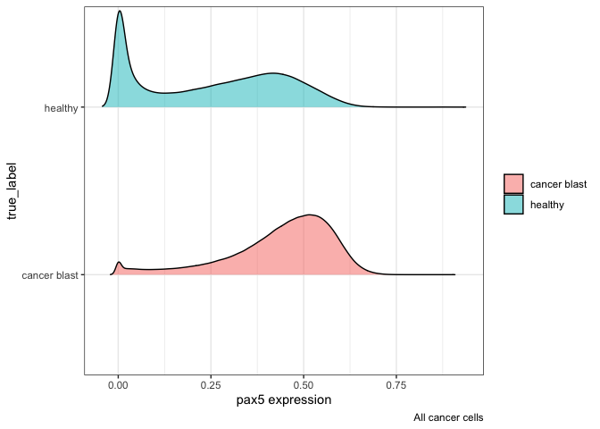
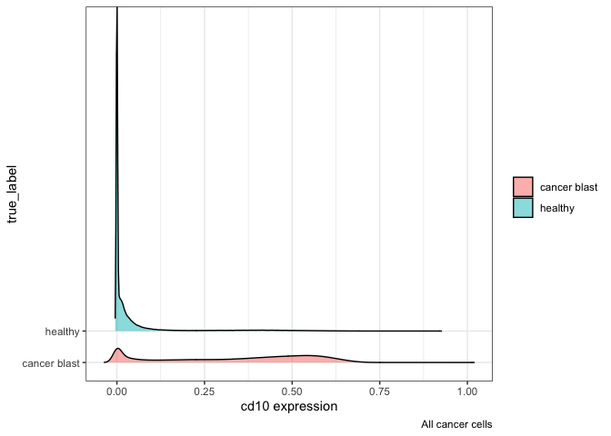
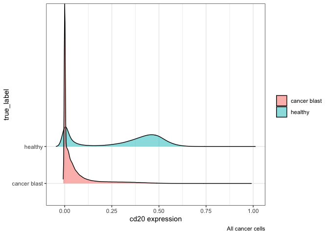

B-ALL healthy vs. cancer cell EM-MIL
================
Timothy Keyes
6/14/23

# Setup

``` r
# libraries
library(tidytof)
library(glmnet)
```

    Loading required package: Matrix

    Loaded glmnet 4.1-7

``` r
library(dplyr)
```


    Attaching package: 'dplyr'

    The following objects are masked from 'package:stats':

        filter, lag

    The following objects are masked from 'package:base':

        intersect, setdiff, setequal, union

``` r
library(ggplot2)

# source needed functions
source(here::here("scripts", "emmil_helper_functions.R"))

# globals

mrd_path <- 
  here::here("data_raw", "mrd_dataset") |> 
  dir(full.names = TRUE)
```

# Read in data

``` r
mrd <- 
  mrd_path |> 
  tof_read_data() |> 
  dplyr::rename_with(
    .fn = \(x) stringr::str_remove(x, pattern = "^.+_"), 
    .cols = dplyr::matches("___")
  ) |> 
  janitor::clean_names() |> 
  dplyr::select(
    -x89y, 
    -dplyr::starts_with("bc"), 
    -x127i, 
    -time, 
    -event_length, 
    -cisplatin, 
    -starts_with("dna")
  ) |> 
  dplyr::rename(cell_type = omiq_filter) |> 
  dplyr::mutate(
    sample_type = 
      dplyr::if_else(stringr::str_detect(file_name, "Healthy"), "healthy", "cancer"), 
    true_label = 
      dplyr::case_when(
        sample_type == "healthy" ~ "healthy", 
        sample_type == "cancer" & cell_type == "blasts NOT" ~ "healthy",
        .default = "cancer blast"
      ), 
    timepoint = 
      dplyr::case_when(
        sample_type == "healthy" ~ "healthy", 
        stringr::str_detect(file_name, "D8") ~ "day_8", 
        stringr::str_detect(file_name, "D15") ~ "day_15",
        stringr::str_detect(file_name, "Dx") ~ "diagnosis", 
        stringr::str_detect(file_name, "Rx") ~ "relapse", 
        .default = "other"
      ), 
    patient = 
      stringr::str_extract(file_name, pattern = "Healthy|MRD_[:digit:]+")
  ) |> 
  dplyr::filter(timepoint != "other")
```

# Clean/preprocess data

``` r
mrd <- 
  mrd |> 
  # apply arcsinh transformation
  tof_preprocess() |> 
  # rescale all markers to 0-1 range
  tof_transform(transform_fun = scales::rescale)
```

# Apply EM-MIL

## Dx model

### Set up training and test set

``` r
# take only cells from healthy samples or diagnostic cancer specimens
mrd_dx <- 
  mrd |> 
  dplyr::filter(timepoint %in% c("healthy", "diagnosis"))

nrow(mrd_dx)
```

    [1] 6048498

``` r
# report simple statistics 
mrd_dx |> 
  count(true_label, sample_type)
```

    # A tibble: 3 × 3
      true_label   sample_type       n
      <chr>        <chr>         <int>
    1 cancer blast cancer      4546088
    2 healthy      cancer      1066197
    3 healthy      healthy      436213

``` r
set.seed(2020L)
split_dx <- 
  mrd_dx |> 
  distinct(patient) |> 
  rsample::initial_split()

split_dx
```

    <Training/Testing/Total>
    <36/13/49>

``` r
training_patients_dx <- 
  split_dx |> 
  rsample::training() |> 
  arrange(patient) |> 
  pull(patient)

training_patients_dx
```

     [1] "Healthy" "MRD_02"  "MRD_03"  "MRD_05"  "MRD_06"  "MRD_09"  "MRD_1"  
     [8] "MRD_10"  "MRD_15"  "MRD_17"  "MRD_19"  "MRD_20"  "MRD_21"  "MRD_22" 
    [15] "MRD_24"  "MRD_25"  "MRD_30"  "MRD_31"  "MRD_32"  "MRD_33"  "MRD_36" 
    [22] "MRD_38"  "MRD_39"  "MRD_4"   "MRD_40"  "MRD_41"  "MRD_43"  "MRD_44" 
    [29] "MRD_45"  "MRD_46"  "MRD_48"  "MRD_49"  "MRD_50"  "MRD_51"  "MRD_7"  
    [36] "MRD_8"  

``` r
test_patients_dx <- 
  split_dx |> 
  rsample::testing() |> 
  arrange(patient) |> 
  pull(patient)

test_patients_dx
```

     [1] "MRD_11" "MRD_16" "MRD_18" "MRD_23" "MRD_26" "MRD_27" "MRD_28" "MRD_34"
     [9] "MRD_35" "MRD_37" "MRD_42" "MRD_47" "MRD_53"

### Estimate zeta (and rho)

``` r
zeta <- 
  mrd_dx |> 
  filter(patient %in% training_patients_dx) |> 
  count(true_label) |> 
  mutate(prop = n / sum(n)) |> 
  filter(true_label == "cancer blast") |> 
  pull(prop)

print(zeta)
```

    [1] 0.7380854

``` r
# start with a value of epsilon
rho <- 
  mrd_dx |> 
  filter(patient %in% training_patients_dx, patient != "Healthy") |> 
  count(patient, cell_type) |> 
  group_by(patient) |> 
  mutate(prop = n / sum(n)) |> 
  ungroup() |> 
  filter(cell_type == "blasts") |>
  summarize(mean_prop = mean(prop)) |> 
  pull(mean_prop)

num_cells_disease <- 
  mrd_dx |> 
  filter(patient %in% training_patients_dx) |> 
  count(true_label) |> 
  filter(true_label == "cancer blast") |> 
  pull(n)

num_cells_disease
```

    [1] 3480987

``` r
num_cells <- 
  mrd_dx |> 
  filter(patient %in% training_patients_dx) |> 
  nrow()

num_cells
```

    [1] 4716239

``` r
zeta_test <- 
  mrd_dx |> 
  filter(patient %in% test_patients_dx) |> 
  count(true_label) |> 
  mutate(prop = n / sum(n)) |> 
  filter(true_label == "cancer blast") |> 
  pull(prop)

print(zeta_test)
```

    [1] 0.7994699

### find case-control adjustment

``` r
# will be zero
case_control_intercept_adjustment <-
  -log((1 - rho) * num_cells_disease / (num_cells - (1 - rho) * num_cells_disease)) + 
  log((1 - rho) * zeta / (1 - (1 - rho) * zeta))

print(case_control_intercept_adjustment)
```

    [1] 0

### fit model

``` r
mrd_dx_sampled <- 
  mrd_dx |> 
  group_by(patient) |> 
  slice_sample(prop = 0.25) |> 
  ungroup()
```

``` r
z <- 
  mrd_dx_sampled |> 
  filter(patient %in% training_patients_dx) |> 
  transmute(
    sample_type, 
    z = as.numeric(sample_type == "cancer")
  ) |> 
 pull(z)

y <- initialize_y(z, rho)
true_y <-
  mrd_dx_sampled |> 
  filter(patient %in% training_patients_dx) |> 
  transmute(
    true_label,
    true_y = as.numeric(true_label == "cancer blast")
  ) |> 
  pull(true_y)

x_train <- 
  mrd_dx_sampled |>
  filter(patient %in% training_patients_dx) |> 
  select(where(is.numeric)) |> 
  as.matrix()

x_test <- 
  mrd_dx_sampled |>
  filter(patient %in% test_patients_dx) |> 
  select(where(is.numeric)) |> 
  as.matrix()
```

``` r
num_iterations <- 20
lls <- rep(0, num_iterations)
```

10 iterations on 235000 cells takes \~ 1.2 minutes.

``` r
lambda <- 0.01

start <- Sys.time()
for(i in 1:num_iterations){
  # maximization step 
  model <- glmnet(x = x_train, y = cbind(1 - y, y), family = 'binomial')
  predictions <- predict(model, newx = x_train, s = lambda) # logit 
  lls[i] = loglik(z, predictions, num_cells_disease, num_cells)
  
  # expectation step 
  adjusted_predictions <- predictions + case_control_intercept_adjustment
  y <- update_y(adjusted_predictions, z, rho, zeta)
}
end <- Sys.time()

end - start
```

    Time difference of 14.65665 mins

### visualize

``` r
data.frame(
  iteration = 1:num_iterations, 
  log_likelihood = lls
) |> 
  ggplot() + 
  geom_point(aes(x = iteration, y = log_likelihood)) + 
  labs(x = "iteration", y = "log likelihood") + 
  theme_bw()
```



``` r
# This should differentiate between the groups.
# Let's only look at the instances where z == 1.
# (We know the labels when z == 0.)

predicted_probabilities <- y[z == 1]

true_labels <- 
  mrd_dx_sampled |> 
  filter(patient %in% training_patients_dx, sample_type == "cancer") |> 
  pull(true_label)

data.frame(
  predicted_probability = predicted_probabilities,
  true_label = true_labels
) |> 
ggplot() +
  geom_violin(aes(x = true_label, y = predicted_probability)) + 
  theme_bw() + 
  labs(x = "true label", y = "predicted probability")
```



``` r
data.frame(
  predicted_probability = predicted_probabilities,
  true_label = true_labels
) |> 
  tidytof::tof_plot_cells_density(
    marker_col = predicted_probability, group_col = true_label, 
    use_ggridges = TRUE, 
    scale = 0.1, 
    alpha = 0.5
  ) + 
  labs(
    x = "Predicted probability", 
    fill = NULL, 
    caption = "training set, only cancer samples"
  )
```



``` r
predictions_test <- 
  predict(model, newx = x_test, s = lambda, type = "response") |> 
  as.numeric()

true_labels_test <- 
  mrd_dx_sampled |> 
  filter(patient %in% test_patients_dx, sample_type == "cancer") |> 
  pull(true_label)

data.frame(
  predicted_probability = predictions_test,
  true_label = true_labels_test
) |> 
ggplot() +
  geom_violin(aes(x = true_label, y = predicted_probability)) + 
  theme_bw() + 
  labs(x = "true label", y = "predicted probability")
```


``` r
data.frame(
  predicted_probability = predictions_test,
  true_label = true_labels_test
) |> 
  tidytof::tof_plot_cells_density(
    marker_col = predicted_probability, group_col = true_label, 
    use_ggridges = TRUE, 
    scale = 0.1, 
    alpha = 0.5
  ) + 
  labs(
    x = "Predicted probability", 
    fill = NULL, 
    caption = "test set, only cancer samples"
  )
```



``` r
model |> 
  glmnet::coef.glmnet(s = 0.01) |> 
  as.matrix() |> 
  as.data.frame() |> 
  as_tibble(rownames = "marker") |>
  rename(coefficient = s1) |> 
  filter(marker != "(Intercept)", abs(coefficient) > 0) |> 
  mutate(
    abs_coefficient = abs(coefficient), 
    sign_coefficient = as.character(sign(coefficient)), 
    marker = forcats::fct_reorder(marker, coefficient)
  ) |> 
  ggplot(aes(x = coefficient, y = marker, fill = sign_coefficient)) + 
  geom_col() +
  ggthemes::scale_fill_tableau() + 
  theme_bw() 
```



``` r
mrd_dx_sampled |> 
  filter(sample_type == "cancer") |> 
  tidytof::tof_plot_cells_density(
    marker_col = pax5, 
    group_col = true_label, 
    use_ggridges = TRUE, 
    scale = 0.1, 
    alpha = 0.5
  ) + 
  labs(
    fill = NULL, 
    caption = "All cancer cells"
  )
```



``` r
mrd_dx_sampled |> 
  filter(sample_type == "cancer") |> 
  tidytof::tof_plot_cells_density(
    marker_col = cd10, 
    group_col = true_label, 
    use_ggridges = TRUE, 
    scale = 0.1, 
    alpha = 0.5
  ) + 
  labs(
    fill = NULL, 
    caption = "All cancer cells"
  )
```



``` r
mrd_dx_sampled |> 
  filter(sample_type == "cancer") |> 
  tidytof::tof_plot_cells_density(
    marker_col = cd20, 
    group_col = true_label, 
    use_ggridges = TRUE, 
    scale = 0.1, 
    alpha = 0.5
  ) + 
  labs(
    fill = NULL, 
    caption = "All cancer cells"
  )
```



``` r
knitr::knit_exit()
```
